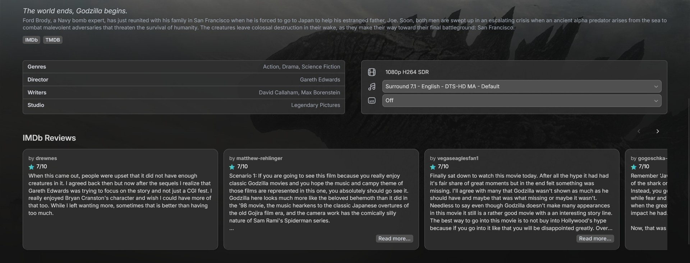

# Reviewer

[](https://github.com/21513/Reviewer/releases)
[](https://jellyfin.org/)
[](LICENSE)
[](https://github.com/21513/Reviewer/releases)

#### I do not always have time to fix bugs or add features. If you want me to update this, contact me or consider sponsoring this project.

Adds a featured section to your Jellyfin home page with automatic recommendations. Modify or reorder categories to fit your preferences.



Works on both desktop and mobile devices. Does not work on clients that don't support web injections.

Clients tested:
- Jellyfin Media Player (Windows)
- Mobile and tablet apps (Android)
- Desktop web browsers (Chrome, Edge, Firefox)
- Mobile web browsers (Chrome, Firefox)

## Features
- Automatic scraping of reviews and ratings
- Responsive design
- ElegantFin theme support

Features that will be added in the future:
- Settings to customize reviews shown
- More sources for reviews and ratings
- Reviews for more media types (TV shows, music, etc.)

## Requirements
- Jellyfin Server v10.11.4 or higher
- Modern web browser with JavaScript enabled

## Installation
This plugin is made for Jellyfin `v10.11.4`

1. Add the following link to your plugin repository list in the Jellyfin dashboard:
    ```
    https://baeac.xyz/jellyfin/plugins/manifest.json
    ```

    Or add this link for the latest development version (unstable):
    ```
    https://raw.githubusercontent.com/21513/Reviewer/main/manifest.json
    ```

2. Find Reviewer in the plugin catalog and install it.
3. Restart your Jellyfin server.
4. Sometimes you have to force refresh your web interface to see the changes: `Ctrl + Shift + R`

## Configuration

Currently, there are no configurable settings for this plugin. Settings will be added in the future.